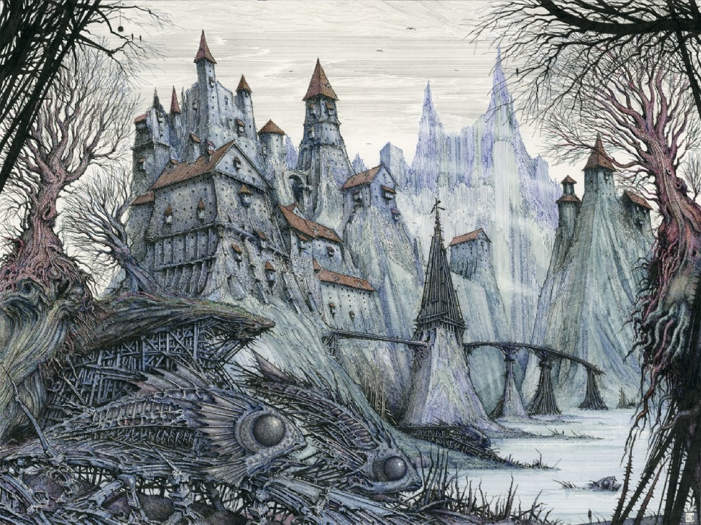

## Jegeldumuth

City originally carved from the side of the cliffs as a Ningala fortress. Conquered by the Chlendi at the opening of the 2nd Epoch as their first act of war against the Heteri and their allies. The city has an open series of mines which drain into the Minkush, and yield copper ore and amberite, an amber coloured crystal favoured by the Chlendi.

### Locations
* **Groghalls and flophouses of note:** 
    * Venno's Bathhouse
    * The Figleaf
    * The Shrunken Head
* **Eskla Temples and Shrines** - along the western cliffside, toward the north of the city, stands are row of once-grand temples and shrines.  Some are still active and beautifully maintained, but many have slipped into obscurity and their structures slowly crumble as the cliff-edge erodes.  It is whispered that some have retreated into tunnels beneath the old shrines and darker sects and heresies have taken over the crypts of their foes.
    * [Chuglaior](../08_religion/heteri_religion.html#chuglaior) - temple
    * [Eluus](../08_religion/heteri_religion.html#eluus) - large temple
    * [The Storm Mother](../08_religion/maetah_religion.html#the-storm-mother) - shrine
    * Lihoe - shrine
    * Bekalas - shrine
    * Domitevati - temple
    * Itil-called-the-Vengeful - shrine
* **Templeround of Thedine** - located in the eastern town, newly constructed among the hovels of Maetah workers.
* **Jeweler's Guild Market**
* **"Old Chlendi Town"** - collection of stilted huts at the water's edge where the mines drain into the Minkush River.

### Organizations
* The Bootrats

#### Notable Families and Clans 
* Bloomfly - Eskla family that are the herditary rules of Jegeldumuth
    * Duchess Ennova Bloomfly
* Enfer - Eskla family tied to the Jeweler's Guild

#### Schools & Guilds 
* Jeweler’s Guild
    * Master: Rehtet Enfer
* Commerce Guild
* Lodge of Coranth
* Lodge of Lelleivantli
* Guild of Arms

